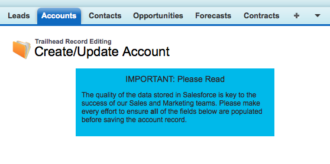
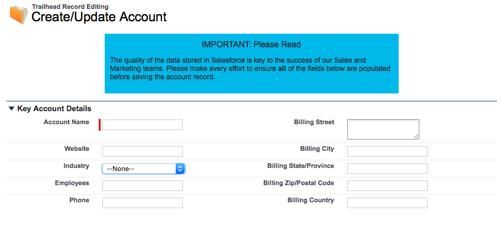
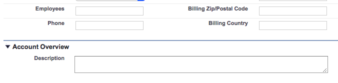
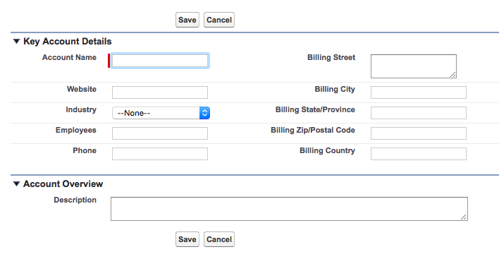
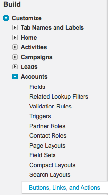
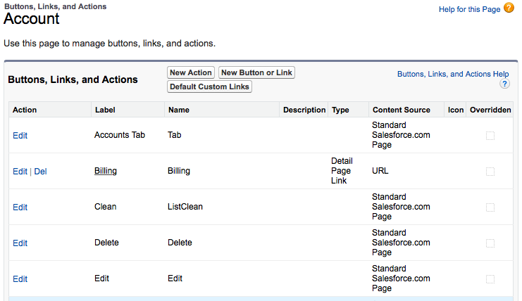
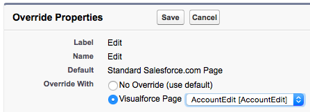

#Managing Data with Visualforce

Forms embedded in Visualforce pages provide a mechanism to create and update Salesforce records, for example to provide a branded user experience or give additional instructions to the user. Data is captured into sObject fields using the standard <apex:inputField /> Visualforce component. In this Quick Start you will create a Visualforce page to edit Account records and override the standard Salesforce Edit and Create pages with this Visualforce page.

##Step 1 - Create the Visualforce Page
1. In your DE environment click **Your Name | Developer Console**
2. Select **File | New | Visualforce Page**
3. For the page name, enter **AccountEdit** and click the **OK** button
4. Change the markup for the opening `<apex:page>` tag to the following:  

        <apex:page standardController="Account">
> A standard controller is provided by the Force.com platform for all standard and custom objects. This provides methods to save new or updated records to the Salesforce database, allowing edit pages to be built without having to write a single line of Apex code
5. Add the following markup after the opening `<apex:page>`tag:

        <apex:sectionHeader title="Trailhead Record Editing" 
                  subtitle="Create/Update Account"/>
        

            

                IMPORTANT: Please Read
            

    	    

        	  The quality of the data stored in Salesforce is key to the 
              success of our Sales and Marketing teams. Please make every
              effort to ensure <strong>all</strong> of the fields below are
              populated before saving the account record.
    	    
	
        

6. View the page by entering the following URL in your browser:

`https://<salesforce_instance>/apex/AccountEdit`, where `<salesforce_instance>` is the instance of Salesforce that is hosting your DE environment, for example `na6.salesforce.com`. Our page now displays additional instructions for the user, but as yet no way for them to enter data.

##Step 2: Add the Form

1. Immediately above the closing `</apex:page>` tag, add the following markup create a Visualforce form:

        <apex:form>
        </apex:form>

2. Inside the form tags, add the following markup:

        <apex:pageBlock mode="mainDetail">
            <apex:pageBlockSection title="Key Account Details">
                <apex:inputField value="{!Account.Name}"/>
                <apex:inputField value="{!Account.BillingStreet}"/>
                <apex:inputField value="{!Account.Website}"/>
                <apex:inputField value="{!Account.BillingCity}"/>
                <apex:inputField value="{!Account.Industry}"/>
                <apex:inputField value="{!Account.BillingState}"/>
                <apex:inputField value="{!Account.NumberOfEmployees}"/>
                <apex:inputField value="{!Account.BillingPostalCode}"/>
                <apex:inputField value="{!Account.Phone}"/>
                <apex:inputField value="{!Account.BillingCountry}"/>
            </apex:pageBlockSection>
        </apex:pageBlock>

Reloading the page shows the input fields that have been added to the form:

> The special merge syntax used to specify the value of the `<apex:inputField/>` component creates a binding from the input to the field of the record being managed by the standard controller. Any updates made to fields bound to an `<apex:inputField>`  component are applied to the record being managed when the form is submitted, with no additional effort on your part.  
> The `<apex:inputField />` component renders HTML markup specific to the type of the field: `Account.Industry` is a picklist field so an HTML select input will be generated. `Account.BillingStreet`, however,  is a textarea field so an HTML textarea input will be generated.

##Step 3 - Add the Account Description Input
For the purposes of this Quick Start, the users would like to be able to write a lengthy description of each account to be stored against the record.

1. Add the following markup immediately after the closing `</apex:pageBlockSection>` tag:

            <apex:pageBlockSection title="Account Overview" columns="1">
                <apex:inputField style="width:85%" value="{!Account.Description}" />
            </apex:pageBlockSection>

2. Reload the page to see the new section and wide input:

  

> The `style="width:85%"` attribute instructs the `<apex:inputField/>` component to generate a text area taking up 85% of the available space. Without this the width would default to that of the inputs in the **Key Account Details** section.

##Step 4 - Add Save and Cancel Buttons

Our form now has the fields that the users require, but no way for them to save their records to the Salesforce database. 

1. Add the following markup under the opening `<apex:pageBlock>` tag:

            <apex:pageBlockButtons>
                <apex:commandButton action="{!save}" value="Save"/>
                <apex:commandButton action="{!cancel}" value="Cancel"/>
            </apex:pageBlockButtons>

2. Reload the page to see the new buttons:

> The default behaviour of the <`apex:pageBlockButtons>` component is to place buttons at the top and bottom of the page block. This may be altered by specifying the `location` attribute for the component as `''top"` or `"bottom"`.

##Step 4 - Test the Page
1. Enter the details for a new account record and click the **Save** button. The new account is saved to the database and your browser is redirected to the standard Salesforce View page, with a URL of the form: `https://<salesforce_instance>/<record_id>`, e.g. `https://eu3.salesforce.com/001w000001LmC6X`.
2. Edit the URL and insert `apex/AccountEdit?id=` prior to the `record_id`, resulting in a  URL of the form: `https://eu3.salesforce.com/apex/AccountEdit?id=001w000001LmC6X`. This will take you to the same custom Visualforce page, but with the contents of the Account record matching the id loaded into the form to allow you to update the existing record.

##Step 5 - Override the Standard Edit Page
Users are unlikely to be happy with a solution that requires them to edit the URL each time they need to create or update an account record. Salesforce allows you to override standard pages with Visualforce versions on a per-sObject basis. 

1. Click **Your Name | Setup**
2. Locate the **Create** menu, expand the **Customize** submenu, expand the **Account** submenu and click the **Buttons, Links, and Actions** option

  
  
3. On the resulting page, locate the item in the list with the label **Edit** and click the **Edit** link in the **Action** column:

  
  
4. On the resulting page select the **Visualforce Page** radio button for the **Override With** element, choose **AccountEdit [Account Edit]** from the list of pages and click the **Save** button:

  
  
5. Repeat the above two steps for the item in the list with the label **Create**  
6. Test the Edit override. Navigate to any Account record and click the **Edit** button - the platform automatically loads the custom Visualforce override page populated with the details of the selected Account record  
7. Test the Create override. Navigate to the Account tab and click the **New** button - the platform automatically loads the custom Visualforce override page, but with all fields empty as you are creating a new record

> Note that only Visualforce pages that use the standard controller for the sObject in question can be used to override a standard page.    

>**Warning**: Overriding standard pages with Visualforce makes the user interface more resistant to change. For example, if a new field is added to the sObject this requires a change to the Visualforce page as opposed to dragging and dropping the field onto the page via the page layout editor.  For this reason the decision to override a standard page with Visualforce should not be taken without considering the additional effort required as well as the benefits that a custom page provides.

